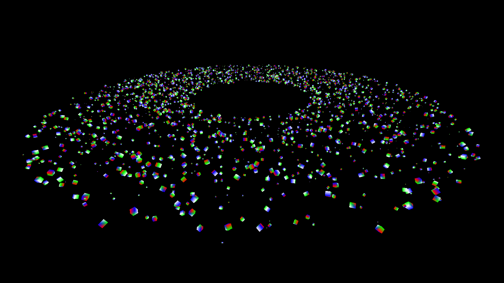
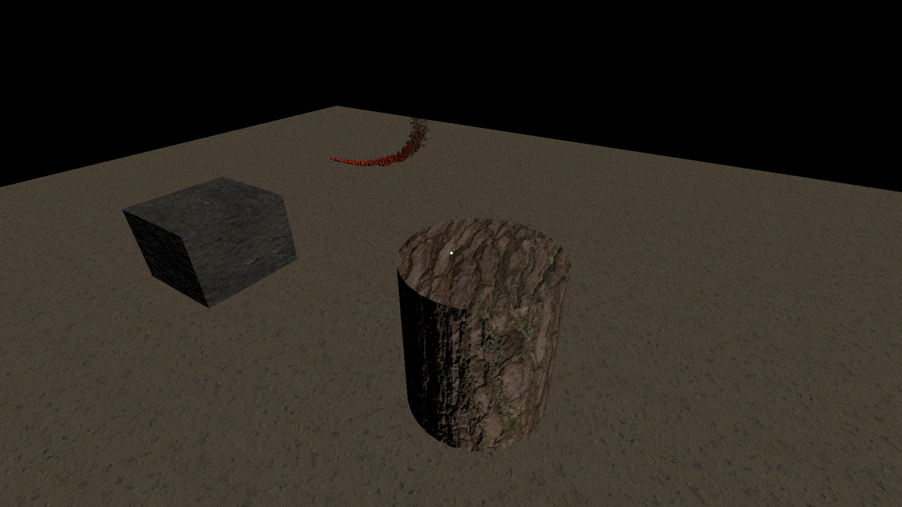

# Ansel Engine

## Installation
Installing Ansel is super easy, all you have to do is clone the git repository and start programming in the **Game** project. 

Alternatively, you can create your own project with or without Visual Studio. In order to do this you must set `Ansel/src` as an include directory as well as AnselECS/src if you wish to take advantage of the Component System. Both `Ansel.dll` and `AnselECS.dll` must be in your executable directory, and their corresponding `*.lib` files found in `bin/'Your Configuration'/Ansel.lib` and `bin/'Your Configuration'/AnselECS.lib` respectively. 

## Utilizing the Component System

The only file you need to include is `Ansel.h` even if you are using the Component System. However, a preprocessor definition must be defined. This can be found in Visual Studio by going to your project's properties and navigating to `C/C++ -> Preprocessor` and defining `__CLIENT_ECS`. (This is already done in the repository's game project.)

## Future Plans
At the moment I am really working on integrating and developing the Component system the most. However, right now you can write your own shaders, but it will not utilize any of the code/functions that run things like lighting calculations and matrix generation because yours will be used in the default's place. However, this will be changed to allow the user to utilize these things as well as use their own shader. 

Perhaps, in the distant future, this will allow for an easy implementation of a user-friendly shader generator.

# Images

## Instancing

2,500 cubes being rendered with unique rotation, scale, and translation at 60 FPS. This image was taken with 3D was first implemented. 

[//]: # (

## Materials

This image was taken when UI elements and Materials were implemented.

